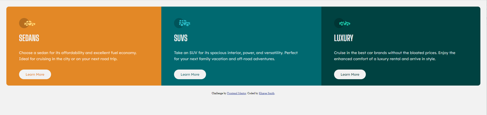
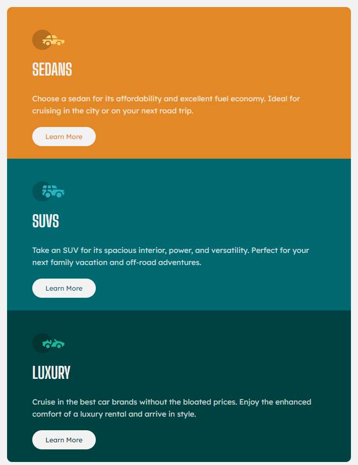

# Frontend Mentor: 3-Column Preview Card Component Solution

This is a solution to the 3-Column Preview Card Component challenge on [Frontend Mentor](https://www.frontendmentor.io/challenges/3column-preview-card-component-pH92eAR2-).

These challenges help improve coding skills by building realistic projects. 

## Table of contents

- [Overview](#overview)
  - [The Challenge](#the-challenge)
  - [Screenshots](#screenshots)
  - [Links](#links)
- [The process](#my-process)
  - [Built with](#built-with)
  - [What I learned](#what-i-learned)
  - [Continued development](#continued-development)
  - [Useful resources](#useful-resources)
- [Author](#author)
- [Acknowledgments](#acknowledgments)


## Overview

### The Challenge

Users should be able to:

- View the optimal layout depending on their device's screen size 🖥📱💻📺
- See hover states for interactive elements 🖱

### Screenshots
View on Desktop 🖥


View on Mobile 📱


### Links

- [Solution URL](https://www.frontendmentor.io/solutions/3column-preview-card-solution-5pbYaaLXa)
- [Live Site URL](https://khareesmith.github.io/FEM_3-Card-Component/)
---
## My process

### Built with

- Semantic HTML5 markup
- CSS custom properties
- Flexbox
- Google Fonts
- Mobile-first workflow

### What I learned

This project was a showcase of my current skills with web development and my first with coding from a design and style guides. Generally speaking, this project was not very difficult. I did learn a bit about using custom CSS properties, which was employed with the naming of the different colors in the project for easy re-use.

Also one of my first uses with Flexbox and using a CSS reset to allow for easier styling from the start. Using a mobile-first approach significantly improved completing the project in a manner I was happy with.

```css
:root {
    --sedan-orange: hsl(31, 77%, 52%);
    --suv-blue: hsl(184, 100%, 22%);
    --lux-blue: hsl(179, 100%, 13%);
    --light-grey: hsl(0, 0%, 95%);
    --white: hsla(0, 0%, 100%, 0.75);
}
```

### Continued development

In the future, I will seek to use a lot of the tools I have used in this project (ie. Flexbox, CSS custom variables) for further development. One of my goals in the future will be to streamline the process for coding. There were several hiccups along the way that could be solved with a better workflow.

### Useful resources

- [Flexbox in 20 minutes](https://www.youtube.com/watch?v=JJSoEo8JSnc&t=1018s) - This helped me understand Flexbox pretty quickly. It only covered a lot of basics, but was crucial for the styling.
- [Codepen](https://codepen.io) - I used this to quickly see the changes to my webpage as I coded. Was very crucial while I figured out my media query for desktop devices.

---

## Author

- Website - [Khareesmith.com](http://khareesmith.com) <-- I built this too!
- Frontend Mentor - [@khareesmith](https://www.frontendmentor.io/profile/yourusername) 
- Linkedin - [Kharee's Linkedin](https://www.linkedin.com/in/khareesmith/)

